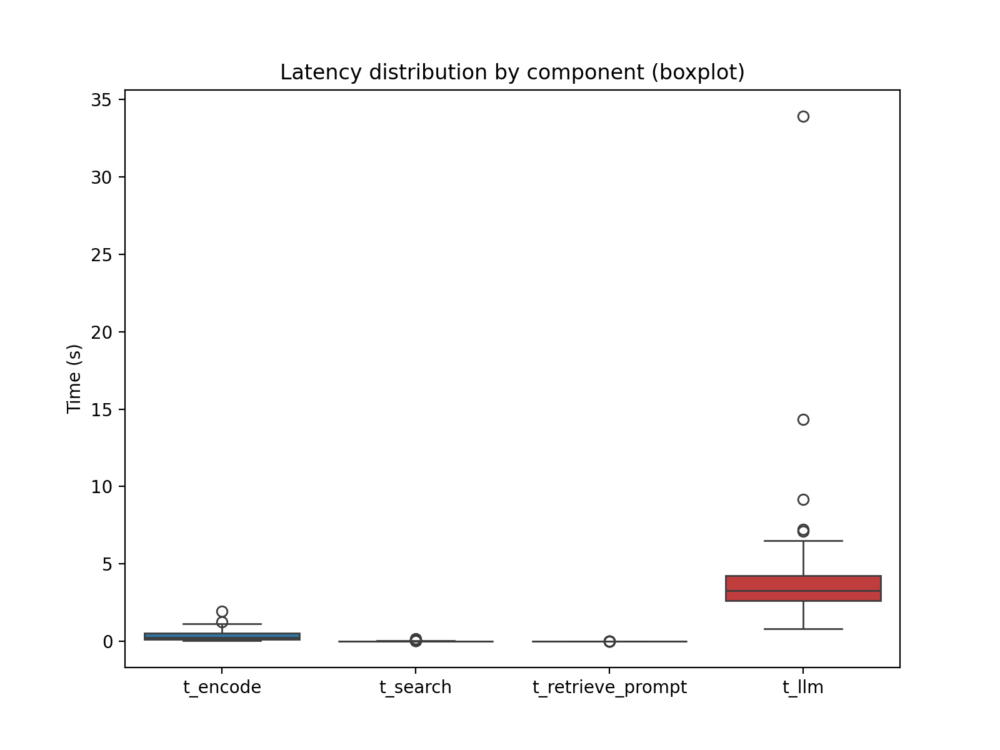

# Local Retrieval-Augmented Generation (RAG) System

A high-performance, locally-hosted RAG pipeline built from scratch. This system enables precise question-answering over private datasets by combining semantic vector search with large language model (LLM) generation.

## 🚀 Overview
Traditional LLMs often struggle with hallucinations or outdated information. This project solves that by implementing a "closed-book to open-book" architecture:
1.  **Ingestion**: Documents are embedded into a 768-dimensional vector space using the **BAAI/bge-base-en-v1.5** encoder.
2.  **Retrieval**: A vector database (built with **FAISS**) identifies the top-K most relevant document chunks for a given query.
3.  **Generation**: A local LLM (**TinyLlama-1.1B** or **Qwen2**) generates a response grounded strictly in the retrieved context.

## 🛠️ Tech Stack
* **Vector Search**: FAISS (Facebook AI Similarity Search)
* **LLM Inference**: llama.cpp / llama-cpp-python
* **Models**: BGE-base-en-v1.5 (Encoder), TinyLlama-1.1B-Chat, Qwen2-1.5B
* **Data Handling**: NumPy, Pandas, Matplotlib (for performance analytics)

## 📊 System Analysis & Optimizations
A core focus of this project was benchmarking system bottlenecks and exploring hardware/software tradeoffs.

### Latency Breakdown
The following analysis identifies the time distribution across the RAG pipeline.
* **Encoder**: ~[X]ms per query.
* **Vector Search**: Sub-millisecond retrieval even at 10k+ document scale.
* **LLM Generation**: Represents the primary bottleneck (~85% of total latency).



### Key Experiments
* **IVF vs. Flat Search**: Implemented `IndexIVFFlat` to optimize search speed for scaling. While `IndexFlatL2` provides perfect accuracy, IVF search showed a [X]% speedup with negligible loss in retrieval precision.
* **Batching Performance**: Benchmarked throughput across batch sizes (1 to 128). Observed that while total throughput increases, individual query latency follows a non-linear growth curve due to CPU cache limits.
* **Top-K Tradeoffs**: Evaluated how increasing context (K=1 to K=5) impacts LLM reasoning quality versus token generation speed.

## 📂 Project Structure
* `main.py`: Interactive CLI for the RAG system.
* `vector_db.py`: FAISS index management (Flat and IVF implementations).
* `encode.py`: Wrapper for high-dimensional semantic embedding.
* `llm_generation.py`: Local inference engine for GGUF models.
* `bench/`: Comprehensive benchmarking suite and visualization scripts.

## 🏁 Getting Started
1.  **Install Dependencies**:
    ```bash
    pip install faiss-cpu llama-cpp-python numpy pandas matplotlib
    ```
2.  **Download Models**:
    Place `bge-base-en-v1.5-f32.gguf` and `tinyllama-1.1b-chat-v0.3.Q4_K_M.gguf` in the root directory.
3.  **Run the System**:
    ```bash
    python main.py
    ```

---
*Developed as part of CS4414 at Cornell University.*
